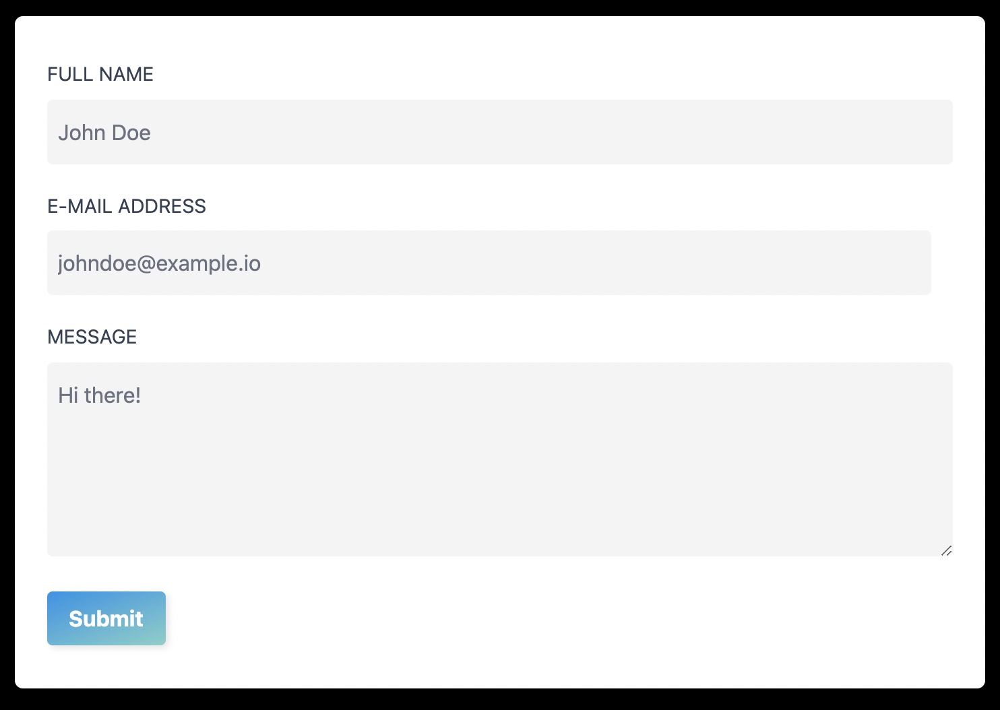

# Get Started

## Quick Start

You can get setup with our custom data backup and recovery plans by completeing the form below <TODO: link..>:
#

A Source Project tenant will create a custom data plan for your needs. Once done, new client onboarding will begin where we walk through how to use our software in just a few clicks.

## Use Cases 

#### Migrate your workloads to useSource cloud environment.
Our cloud environment makes it easy to scale your workloads for file shares, database, and application storage without modifying how you manage your data.

#### Accelerate your performance workloads
The data storage technology offers scalability to access your data securely consistently with versioned replicas in case of failover. Overall increasing workload performance within budget and flexibility to connect from your Linux, Windows, and macOS environments.

#### Simplify business continuity
Managing backups and long-term data retention on premises can be complex, time consuming, and costly. Our hosted cloud environment lets you easily and securely backup, archive, or replicate your on-premises file storage to AWS in order to meet regulatory, data retention, or disaster recovery requirements.

#### Manage HIPAA compliant patient, financial and secure data efficiently
We provide support beyond native platforms like Linux, Windows, and Mac. We provide HIPAA compliant, secure, private, and versioned infrastructure for your data needs no matter if you need a place to back up financial data, patient data, or private data.

## Resources

The primary resources in our hosted cloud environment are *file systems* and *backups*. Backups are file-system-consistent, highly durable, and incremental. 

> A file system is made up of one or more file servers and storage volumes.

> Automatic daily backups are turned on by default for your file system, and you can also take additional manual backups at any time.

## Security and data protection

Our hosted cloud environment provides multiple levels of security and compliance to help ensure that your data is protected. 
It automatically encrypts data at rest (for both file systems and backups) using keys that we manage in a Key Management Service (AWS KMS). 
Data in transit is also automatically encrypted using session keys. It has been assessed to comply with ISO, PCI-DSS, and SOC certifications, and is HIPAA eligible.

We also provide access control at the file and folder level with Windows access control lists (ACLs).
It provides access control at the file system level using security groups. Users accessing file systems are authenticated with Microsoft Active Directory.

Additionally, it protects your data by taking highly durable backups of your file system automatically on a daily basis and allows you to take additional backups at any point.

## Price and performance
`Pay only for what you need.`

Our data backup & recovery service gives you the price and performance flexibility by offering both solid state drive (SSD) and hard disk drive (HDD) storage types. 

> HDD storage is designed for a broad spectrum of workloads, including home directories, user and departmental shares, and content management systems. SSD storage is designed for the highest-performance and most latency-sensitive workloads, including databases, media processing workloads, and data analytics applications.

Nextra works like a Next.js plugin, and it accepts a theme config (layout) to render the page. To start:

